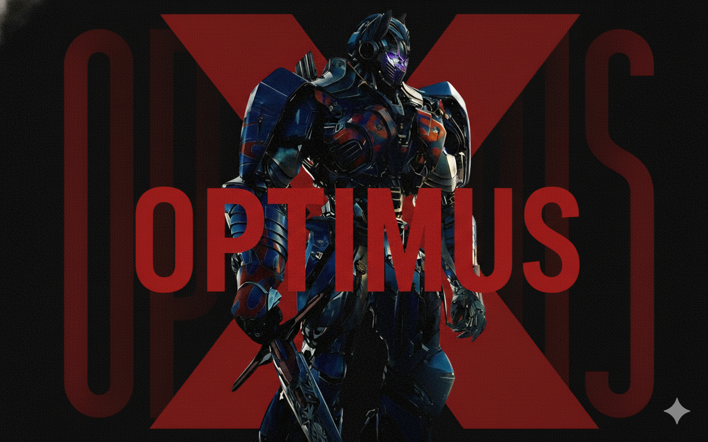

# X-OPTIMUS TG BOT

  

A powerful Telegram bot built with Python.

​⚠️ IMPORTANT UPDATE SAFETY WARNING
​

🚨 WARNING: HIGHLY INTERCONNECTED CODEBASE 🚨

All files are interconnected and will be overwritten during the update.

The ONLY file protected from changes is <code style="background-color: #ff9999; padding: 3px 6px; border-radius: 3px;">config_data/config.env</code>.

DO NOT make local changes to any other script or plugin outside of this file!

---

## **REQUIREMENTS**

Before deploying the bot, you need to obtain the following credentials:

- **API ID** and **API Hash**: Get them from [https://my.telegram.org](https://my.telegram.org)
- **Session String**: Generate it by clicking the button below

  

---

## **DEPLOYMENT METHODS**

### **1. Deploy on Render**

  

Click the button above to deploy directly to Render. The `render.yaml` file is already configured.

**Required Environment Variables:**
- `API_ID` - Your Telegram API ID
- `API_HASH` - Your Telegram API Hash
- `SESSION_STRING` - Your session string from the link above

Simply fill in these variables during deployment and your bot will be up and running!

IT WILL UPADTE AUTOMATICALLY NO NEED TO UPDATE COMMAND

---

### **2. Deploy on Koyeb**

  

Click the button above to deploy directly to Koyeb. The `koyeb.yaml` file is already configured.

**Required Environment Variables:**
- `API_ID` - Your Telegram API ID
- `API_HASH` - Your Telegram API Hash
- `SESSION_STRING` - Your session string from the link above

Your bot will be deployed and running on Koyeb's infrastructure!

IT WILL UPADTE AUTOMATICALLY NO NEED TO UPDATE COMMAND

---

### **3. Deploy on Panel**

1. **Upload Files**: Upload all bot files to your panel
2. **unzip**:If it is zip uzip it
3. **MOVE FILES**:Move files to container (../)
4. **Set Startup Command**: Set `main.py` as the startup file
5. **Configure Environment Variables**: Add the following env variable in container_data/config.env:
   - `API_ID`
   - `API_HASH`
   - `SESSION_STRING`
6. **Start the Bot**: Click start and your bot will begin running
7. 

/update COMMAND MUST BE USED FOR UP TO DATE USE

---

## **CREDITS**

**Made by Lucas**

- Telegram: [@codlucas](https://t.me/codlucas)
- GitHub: [COD-LUCAS](https://github.com/COD-LUCAS)

---

*For support and updates, contact via Telegram or check the GitHub repository.*
